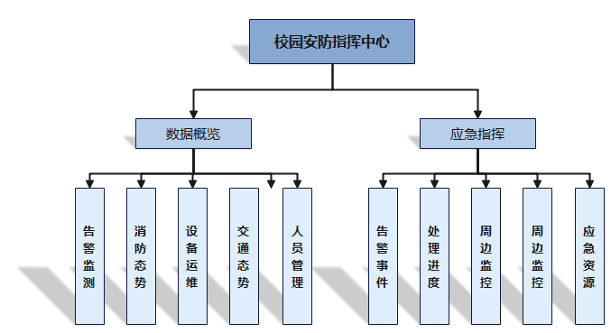
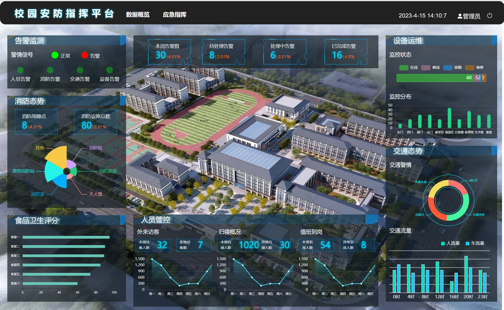
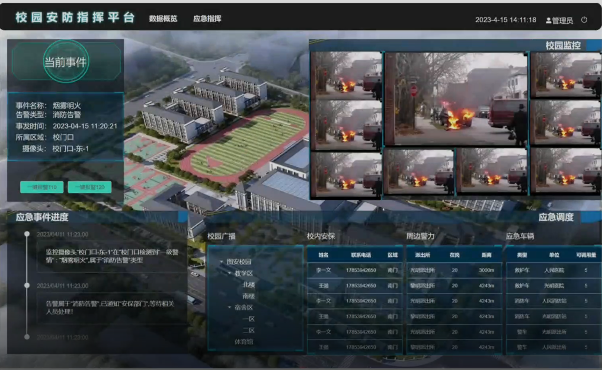

<h1 align="center" style="margin: 30px 0 30px; font-weight: bold;">图安校园安防指挥平台 v1.0</h1>
<h4 align="center">基于Vue+Echarts开发的可视化大屏</h4>

## 平台简介

图安校园安防指挥平台，采用vue框架，实现了与图安校园安防综合管理平台[tuan-admin-ui](https://github.com/QJC1123/tuan-admin-ui)对接的移动解决方案！展示校园各项安防指标的统计情况，跟进告警事件处理。属于“校园安防智能保障系统”的平台之一，“校园安防智能保障系统”项目获第十四届服务外包创新创业大赛**国家级二等奖**。

平台目前已经实现数据概览、应急指挥等功能。

* 应用框架基于[vue](https://cn.vuejs.org/guide/introduction.html)。
* 前端组件采用[element-ui](https://www.uihtm.com/element/#/zh-CN)，全端兼容的高性能UI框架。
* [Echarts](https://echarts.apache.org/zh/index.html)展示多种多种图表。
* 实现浏览器播放Rtsp监控视频流

## 功能模块

#### 数据总览
1. 告警监测 
    监测并展示人员告警、消防告警、交通告警、设备告警这四种警情信号。

2. 消防态势 
    展示消防设施类型和数量，显示故障消防点。

3. 设备运维 
    展示监控设备的工作状态和区域分布情况。

4. 交通态势 
展示校园车流量和人流量，展示各类型交通告警。

5. 人员管控 
展示值班人员到岗情况、学生归寝情况、外来访客情况。

#### 应急指挥
1. 告警事件 
    展示告警事件信息

2. 处理进度 
   跟进事件处理进展情况并实时显示。

3. 周边监控 
    调取告警摄像头及周边监控摄像头的监控画面并展示。

4. 应急资源 
    查看校内安保分布情况，调度校内广播，便于大范围通知。
    展示校外应急资源，如执勤警车及离周边警力点的距离，有助于调集警力第一时间赶赴现场。

## 演示图

#### 数据概览
  
 

**Echarts实现多种图表:** 
* 折线图: 外来访客人员统计,归寝人员统计,值班到岗人员统计
* 环形图: 警情类型占比
* 柱状图：监控区域分布
* 条形图：各食堂卫生评分，监控状态分析
* 南丁格尔玫瑰图：消防设施占比

#### 应急指挥
 

1. 应急事件 
    展示告警事件名称、类型、事件、地点等信息。

2. 校园监控 
    调取告警事件地点附近监控摄像头，RTSP视频流转码成WebRTC支持的视频格式，浏览器中播放监控视频。

3. 应急调度 
    展示校内安保、周边警力、应急车辆等安防资源。

4. 处理进度 
    跟进告警事件处理流程，跟进告警发生，人员处理，处理结果等进度。

## 开发
        # 克隆项目
        git clone https://github.com/QJC1123/tuan-control-center

        # 进入项目目录
        cd tuan-control-center

        # 安装依赖
        npm install

        # 启动服务
        npm run dev

